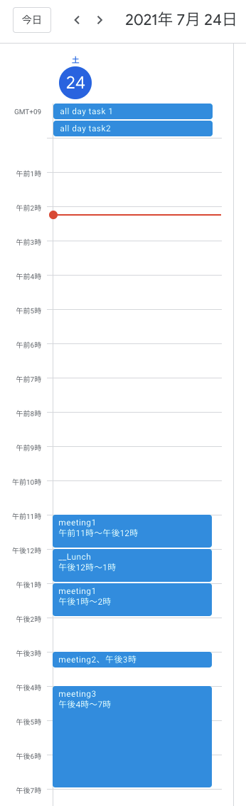

# Vgcal

The vgcal command was created to simplify the display of my Google calendar schedules.

## Installation

```shell
$ gem install vgcal
```

## First run

- Setup Google API
  - [Create a project and enable the API](https://developers.google.com/workspace/guides/create-project)
  - [Create credentials](https://developers.google.com/workspace/guides/create-credentials)
    - [When creating an OAuth client ID, the application type will be a desktop application](https://developers.google.com/workspace/guides/create-credentials#desktop)
  - [Enable Google Calendar API](https://console.cloud.google.com/apis/library/calendar-json.googleapis.com)

```shell
$ gem install vgcal
$ vgcal init
Fix the __FIX_ME__ in /Users/ito.shota/.vgcal/credentials.json
$
```

## Usage

```shell
# help
$ vgcal
Commands:
  vgcal help [COMMAND]  # Describe available commands or one specific command
  vgcal init            # Make directory and template credentials.json for Google authentication
  vgcal show            # Show google calendar
  vgcal version         # View vgcal version
$
$ vgcal help show
Usage:
  vgcal show

Options:
  -d, [--date=DATE]                          # Show relative date. ex.-1, +10
  -c, [--current-week], [--no-current-week]  # Show current week tasks
  -n, [--next-week], [--no-next-week]        # Show next week tasks
  -s, [--start-date=N]                       # Start date. ex.20210701
  -e, [--end-date=N]                         # End date. ex.20210728
  -o, [--output=OUTPUT]                      # Output format. [text|json]

Show google calendar
$
```

### example



```shell
# Today's schedule
$ vgcal show
Period: 2021-07-24T00:00:00+09:00 - 2021-07-24T23:59:59+09:00

My tasks: 5.25h(0.66day)
  ・all day task 1: 0h
  ・all day task2: 0h
  ・meeting1: 2.0h
  ・meeting2: 0.25h
  ・meeting3: 3.0h

Invited meetings: 0h(0day)

# This week's schedule (starting on Sunday)
$ vgcal show -c

# Schedule for 5 days ago
$ vgcal show -d -5

# 1 day later
$ vgcal show -d +1

# Schedule for 2021/07/01 - 2021/07/28
$ vgcal show -s 20210701 -e 20210728

# Formatted json
$ vgcal show -o json | jq .
{
  "start_date": "2021-09-05T00:00:00+09:00",
  "end_date": "2021-09-05T23:59:59+09:00",
  "tasks": [
    {
      "title": "all day task 1",
      "time": 0,
      "task_type": "my_task"
    },
    {
      "title": "task a",
      "time": 1,
      "task_type": "my_task"
    },
    {
      "title": "task b",
      "time": 1,
      "task_type": "my_task"
    }
  ]
}
```

## Development

```shell
$ git clone git@github.com:st1t/vgcal.git
$ cd vgcal/
$ bundle install
$ bundle exec ruby exe/vgcal show -d -5
$ rake spec

Vgcal
  has a version number

Vgcal::MyCalendar
  my_task
  my_task_hidden
  invitation_task

Finished in 0.01492 seconds (files took 0.75345 seconds to load)
4 examples, 0 failures

$ 
```
